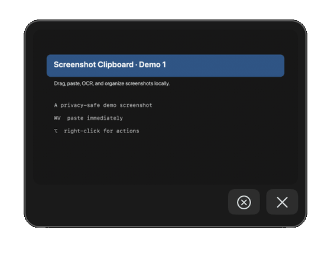

# Screenshot Clipboard for macOS

[](https://github.com/zexy2/screenshot-clipboard-mac/actions/workflows/ci.yml)
[](https://www.apple.com/macos/)
[](https://www.swift.org/)
[](LICENSE)

A small, local-first macOS utility that keeps native screenshots immediately
pasteable, provides a native-looking preview, and stores an organized on-disk
file for later use.

It is intentionally built as a dependency-free Swift/AppKit app. The helper
does not need an API key, account, server, or background network service.



The feature tour shows the preview and clipboard flow, the per-image right-click
menu (`Preview`, Finder, OCR, ChatGPT, Gemini, and Trash), and the native
Turkish ↔ English translation options.

## Why this exists

macOS can place a screenshot in the clipboard or save it to disk, but switching
between those workflows is easy to forget. Screenshot Clipboard watches the
general pasteboard for PNG screenshots and keeps both workflows available:

- `⌘V` can paste the image immediately.
- A native-looking preview remains available in the lower-right corner.
- A canonical file is saved locally and organized by the application that was
  active when the screenshot was taken.

## Features

- Works with native `⇧⌘4` and `⇧⌘5` screenshot workflows when the screenshot is
  published to the general pasteboard.
- Keeps a detected PNG available on the general pasteboard for immediate `⌘V`
  instead of waiting for a thumbnail timeout.
- Stores screenshots under:

  ```text
  ~/Desktop/Ekran Görüntüleri/Mac Ekran Görüntüleri/
  ├── Genel Ekran Görüntüleri/       # canonical files
  └── Uygulamalar/<App>/             # hard links by source app
  ```

- Includes the source application in the filename, for example:
  `Ekran Resmi 2026-08-27 21.49.06 - Google Chrome.png`.
- Shows up to three previews with compact stacking or an expanded card view.
- Supports individual close, close-all, right-swipe dismissal, drag-to-file,
  `Preview` opening, Finder reveal, and file-path copying.
- Runs OCR with Vision and can copy detected text to the clipboard.
- Adds explicit right-click actions for sending the selected screenshot to a
  new ChatGPT or Gemini conversation for Turkish translation.
- Translates selected text with Apple’s on-device Translation framework on
  macOS 26+, with quick replacement or review-before-apply mode.
- Restores the three newest saved previews after login.
- Uses adaptive pasteboard polling: a low-frequency idle interval with a short
  burst after a detected change.
- Validates PNG size, dimensions, and decodability before saving.
- Uses a per-user LaunchAgent so the helper starts after login and is relaunched
  if it exits.

## Requirements

- macOS 13 or newer.
- Xcode Command Line Tools, including `swiftc`, `codesign`, `plutil`, and
  `launchctl`.
- Apple silicon or Intel Mac; the source uses portable AppKit APIs. CI currently
  validates on a macOS 26 runner, while Intel hardware is not exercised here.

Optional features:

- Native selected-text translation requires macOS 26+ and installed Turkish and
  English Translation language models.
- Selected-text replacement and ChatGPT/Gemini handoff require Accessibility
  permission.
- ChatGPT/Gemini handoff also requires the corresponding desktop app and an
  already authenticated account. The helper does not log in or bypass service
  limits.

## Install

```bash
git clone https://github.com/zexy2/screenshot-clipboard-mac.git
cd screenshot-clipboard-mac
./Scripts/check.sh
./Scripts/install.sh
```

`install.sh` builds an ad-hoc signed app at
`~/Applications/Screenshot Clipboard.app` and registers a per-user LaunchAgent.
This is a local developer installation, not an Apple-notarized distribution.

On the first run, macOS may ask for access to the Desktop folder. Allow it if
you want the organized file output.

## Use it

1. Take a screenshot with the macOS screenshot shortcut.
2. Use `⌘V` immediately in an image-capable app; the latest screenshot is kept
   in the clipboard.
3. Use the thumbnail in the lower-right corner to drag the image to a file
   destination or right-click it for actions.
4. For OCR, choose `Metni kopyala (OCR)`.
5. For API-free external translation, choose `ChatGPT’de çevir` or
   `Gemini’de çevir`. The image and the Turkish translation prompt are sent
   only after that explicit action.

For `⇧⌘5`, choose `Options → Clipboard` when you want Screenshot Clipboard to
react. A file-only destination bypasses the general pasteboard watcher.

The menu-bar item `Screenshot Clipboard` exposes text-translation settings:

- default selected-text shortcut: `⌥⌘E`;
- direction: Turkish → English or English → Turkish;
- quick replacement or review-before-apply;
- shortcut recording and Translation language settings.

## Permissions and privacy

The helper is local-first, but permissions have concrete effects:

| Permission | Used for | Required? |
| --- | --- | --- |
| Desktop folder access | Saving organized screenshot files | Only for file saving |
| Accessibility | Reading the selected text, replacing it, and automating ChatGPT/Gemini | Only for those features |
| Translation language models | Apple’s native selected-text translation | Only for native translation |

The helper itself does not make HTTP requests, store API keys, or store account
credentials. It reads PNG data from the general pasteboard and the frontmost
application name for foldering.

It does not capture the screen itself and therefore does not need Screen
Recording permission; macOS or another screenshot producer supplies the PNG.

The external ChatGPT/Gemini actions are different from native translation:
they automate the installed app UI. The selected service may upload the image
to its own online service, according to that service’s account and privacy
settings. No screenshot is sent automatically in the background.

The app creates screenshot folders with user-only permissions and rejects PNGs
over 50 MB, images above 10,000 pixels on either side, or images above 50
million pixels. These are guardrails, not a complete security boundary.

## Architecture

The implementation and failure boundaries are documented in
[`docs/architecture.md`](docs/architecture.md). The short version is:

```text
macOS screenshot
      │ PNG on general pasteboard
      ▼
pasteboard monitor ──► validate ──► save canonical file + hard link
      │                                      │
      └──────────────────────────────────────┴──► preview panels
                                                     │
                         drag / OCR / context menu / translation handoff
```

The project deliberately uses a small Swift source tree instead of a package
dependency graph. That keeps installation and auditing simple for a personal
macOS utility.

## Development

Run the same local checks used by CI:

```bash
./Scripts/check.sh
```

The check script validates shell syntax, both property lists, a warnings-as-
errors Swift build, and the ad-hoc code signature. It does not simulate
Accessibility, Finder drag-and-drop, or third-party app UI flows; those need a
real logged-in macOS session.

Useful files:

- `Sources/ScreenshotClipboard/main.swift` — pasteboard monitor, persistence,
  preview layout, OCR, and menu-bar settings.
- `Sources/ScreenshotClipboard/ExternalAppTranslator.swift` — explicit
  ChatGPT/Gemini UI handoff.
- `Sources/ScreenshotClipboard/NativeTextTranslation.swift` — native
  Translation framework integration and safe text replacement.
- `Scripts/build.sh` — local build and signature.
- `Scripts/install.sh` / `Scripts/uninstall.sh` — per-user lifecycle.

## Known limitations

- macOS screenshot UI and third-party app accessibility trees can change. The
  external handoff stops when it cannot find a new conversation, message field,
  or send button; it does not retry indefinitely.
- A free account, quota limit, missing model, or changed ChatGPT/Gemini UI can
  prevent an external translation. This helper cannot remove those limits.
- Native Apple translation quality depends on the installed language models and
  may be weaker than a cloud model for slang, typos, or ambiguous context.
- The app is ad-hoc signed and is not currently packaged as a notarized `.dmg`.
- There is no XCTest target yet. Build-time checks are automated; the
  permission-sensitive UI flows require manual or dedicated macOS integration
  testing.

## Uninstall

```bash
./Scripts/uninstall.sh
```

This removes the installed app and LaunchAgent but does not delete saved
screenshots.

## Contributing

Read [`CONTRIBUTING.md`](CONTRIBUTING.md) before opening a pull request. Please
include the macOS version, reproduction steps, relevant permission state, and
the output of `./Scripts/check.sh` when reporting a bug.

For security-sensitive reports, use the private process in
[`SECURITY.md`](SECURITY.md) instead of a public issue.

## License

MIT — see [`LICENSE`](LICENSE).
