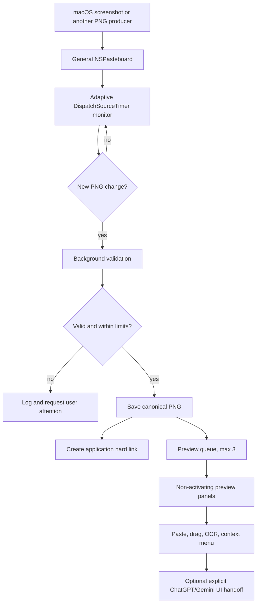

# Architecture

Screenshot Clipboard is a single-process, menu-bar macOS application. It uses
AppKit, Foundation, ImageIO, Vision, ApplicationServices, and the optional
macOS Translation framework. There are no third-party runtime dependencies.

## Runtime flow

## Main components

- `ScreenshotClipboardDelegate`
  - owns the pasteboard monitor and LaunchAgent-facing app lifecycle;
  - tracks the last user-facing frontmost application name;
  - validates PNG headers, dimensions, decoded image data, and queue pressure;
  - saves the canonical file and the application hard link;
  - manages up to three preview panels and their compact/card layouts.
- `DraggableImageView`
  - distinguishes a click from a drag using a small movement threshold;
  - supplies an `NSDraggingItem` containing both image data and a file URL when
    available;
  - supports right-swipe dismissal through the preview panel’s gesture path.
- `ExternalAppTranslator`
  - checks Accessibility trust before automation;
  - activates the selected installed app and starts a new conversation;
  - pastes the selected image, writes the fixed Turkish prompt, and submits;
  - restores the image to the clipboard after submission;
  - fails closed when an expected accessibility element is missing.
- `NativeTextTranslator`
  - uses Apple’s `TranslationSession` only when macOS 26+ is available;
  - reports unsupported or not-installed language models explicitly.
- `GlobalTranslationShortcut`
  - observes the configured keyboard shortcut through a CG event tap;
  - consumes the matching key event so the shortcut does not leak into the
    target app;
  - uses Accessibility to read and, in quick mode, replace selected text.

## Storage model

For each accepted screenshot, the app writes one canonical PNG under
`Genel Ekran Görüntüleri` and attempts to create a hard link under
`Uygulamalar/<App>`. A hard link gives two discoverable paths to the same file
contents without duplicating the image bytes. If link creation fails, the
canonical file is retained and the error is logged.

Application names are sanitized before becoming folder or filename components.
The output hierarchy is created with mode `0700`; image files are created with
mode `0600` after writing.

## Concurrency and failure boundaries

- Pasteboard polling runs on a dedicated queue. Image validation and disk I/O
  run on a utility queue so the preview UI stays responsive.
- A bounded pending-image count prevents an unbounded burst from consuming
  memory.
- External translation permits one automation operation at a time.
- External automation uses finite waits and no infinite retry loop.
- If the selected text target changes while native translation is running, the
  result is left in the clipboard instead of being pasted into a different
  application or selection.

## Compatibility

The binary declares macOS 13 as its minimum system version. The Translation
framework is weak-linked so screenshot, storage, preview, OCR, and clipboard
features remain available on macOS 13–25. Native selected-text translation
returns a clear unsupported-version result on those systems.
